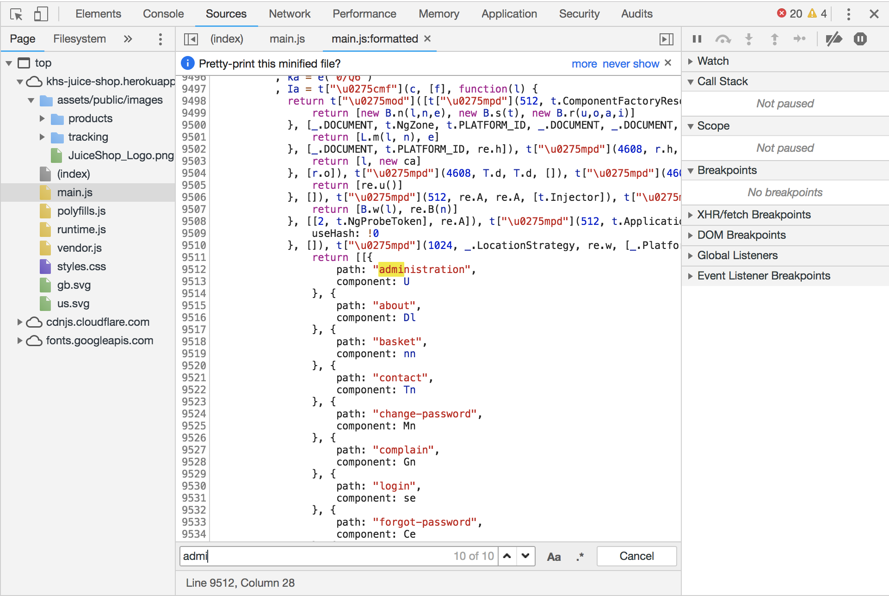

# Juice Shop Hacking Guide

A walkthrough of some of the 1 star "Trivial Challenges" and 2 star "Easy Challenges" for the super vulnerable OWASP Juice Shop web application.

### Resources
* [Challenge Hunting - OWASP Official Hacking Guide](https://bkimminich.gitbooks.io/pwning-owasp-juice-shop/content/part2/)

### Challenges
1. **Find the score board**
    * Since we know the page exists, we can simply guess what the URL will be
    * `https://khs-juice-shop.herokuapp.com/#/score-board`
2. **Find the admin page**
    * Open the developer tools -> Source tab
    * Inspect the `main.js` file
    * `ctrl + f` and search for the word `admin`
    * 
3. **Access a confidential document**
    * Click through different links on the website
    * A link in the `About Us` page takes us to `https://khs-juice-shop.herokuapp.com/ftp/legal.md?md_debug=true`
    * Notice the `/ftp` part of the URL
    * The ftp server is not secured and we can access a confidential file at `https://khs-juice-shop.herokuapp.com/ftp/acquisitions.md`
4. **XSS Tier 0**
    * This challenge asks you to inject code into the URI of the page so that it will be reflected back to you.
    * Navigate to the order tracking page
    * Insert `<iframe src="javascript:alert('xss')">` into the `Order ID` form field
5. **XSS Tier 1**
    * This challenge asks you to inject code into the DOM - Document Object Model
    * Look for places that you could potentially insert malicious code. (i.e. the search bar)
    * Insert `<iframe src="javascript:alert('xss')">` to solve this challenge
6. **Five Star Feedback**
    * Access the administration page
    * Delete all of the 5 star reviews
7. **Security Policy**
    * Check to see how to report any bugs on the website
    * Use this URL - `https://khs-juice-shop.herokuapp.com/security.txt`
    * Adding `security.txt` to most websites will give you the proper way to report any security vulnerabilities to a company